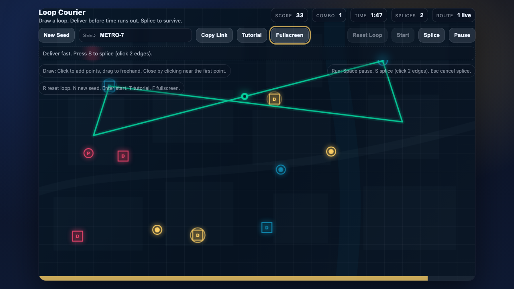

<div align="center">

# Loop Courier

**One courier. Two minutes. Three chances to change the route.**

Draw a delivery loop, send your courier into the city, and keep the parcels moving.

[**Play in your browser →**](https://fortunexbt.github.io/loop-courier/) · [Try city METRO-7](https://fortunexbt.github.io/loop-courier/?seed=METRO-7) · [Run locally](#run-locally)

Mouse, touch, or keyboard. No account needed.

</div>

[](https://fortunexbt.github.io/loop-courier/)

## Your first shift

1. **Plan a loop.** Connect a circle pickup to a square dropoff of the same color, then close the route. Hit **Starter route** if you want to get moving immediately. Planning has no timer.
2. **Dispatch your courier.** You have two minutes to deliver. The courier follows your loop automatically, carrying up to three parcels. Watch their destinations and deadlines under the map.
3. **Adapt on the move.** Traffic jams slow you down; toll zones eat into your score. Use **Splice route** to reconnect two non-adjacent edges while the courier keeps moving. You get three splices per shift.

At the end, run the route again or choose **Edit this route** to try a better plan in the same city.

## More coverage, or a faster lap?

Connecting more colors increases the value of every delivery. But a longer loop can leave parcels circling the city until their deadlines expire. Consecutive deliveries build your combo; a missed parcel breaks it.

Start with one reliable connection. Add another color. Then decide whether the extra distance earns its place.

## Same city. Better route.

**Daily city** gives everyone the same map for the day, changing at midnight UTC. **Share city** copies a seeded link so a friend can try your city too. Retry resets the orders, hazards, and clock, giving you a consistent starting point for each attempt.

Personal bests stay on your device. Compare scores with friends by sharing the city; there is no online leaderboard.

<details>
<summary><strong>Controls & keyboard shortcuts</strong></summary>

All actions have on-screen controls. For keyboard play, focus the map first; text fields and buttons keep their normal keyboard behavior.

| Action | Mouse / touch | Keyboard |
| --- | --- | --- |
| Build a route | Click, tap, or drag; **Starter route** builds a complete loop | Arrow keys choose a station; `Space` adds it |
| Close the loop | **Close loop**, or return to the first point | `C` |
| Undo / reopen | **Undo** | `Backspace` / `Z` |
| Dispatch | **Dispatch courier** | `Enter` |
| Splice | **Splice route**, then two non-adjacent edges | `S`, arrows to choose an edge, `Space` to select |
| Cancel a splice | **Cancel splice** | `Escape` / `S` |
| Pause / resume | **Pause** / **Resume** | `Space` |
| Clear the route | **Clear** | `R` |
| New city | **New city** | `N` |
| Daily city | **Daily city** | — |
| Edit after a shift | **Edit this route** in the report | Tab to the button, then `Enter` |
| Guide | **How to play** | `T` |
| Fullscreen | Fullscreen icon | `F`; `Escape` exits |
| Sound | **Sound on/off** | — |

A route needs at least three points and a matching pickup/dropoff pair. A splice needs at least four points and must keep at least one complete color connection. Parcels already in play keep their original destinations after a splice.

Opening the guide or leaving the tab pauses the shift. Sound starts off.

</details>

## How it works

- **Seeded cities.** A string seed is hashed (`xmur3`) into a `mulberry32` generator, so the same seed always produces the same stations, orders and hazards.
- **Splicing.** Splice route is a 2-opt move on the route cycle: two non-adjacent edges are cut and the loop is reconnected (`twoOptSpliceCycle` in `game-core.js`).
- **One simulation clock.** Live play and replay both advance a fixed-step clock (`simulation-clock.js`), so a seeded run plays out the same at 30 fps or 144 fps.
- **Tested in two engines.** Unit tests cover the core, and browser suites replay full shifts in Chromium and WebKit in CI.

## Run locally

Use Node.js 22 or newer.

```bash
git clone https://github.com/fortunexbt/loop-courier.git
cd loop-courier
npm ci
npm run dev
```

Open [localhost:4173](http://127.0.0.1:4173). The game runs directly from source—there is no build step to play locally.

Built with Canvas, JavaScript modules, and browser APIs. No runtime dependencies.

For tests, project structure, and deployment, see [Contributing](CONTRIBUTING.md). Changes are tracked in the [changelog](CHANGELOG.md).

[MIT License](LICENSE)
